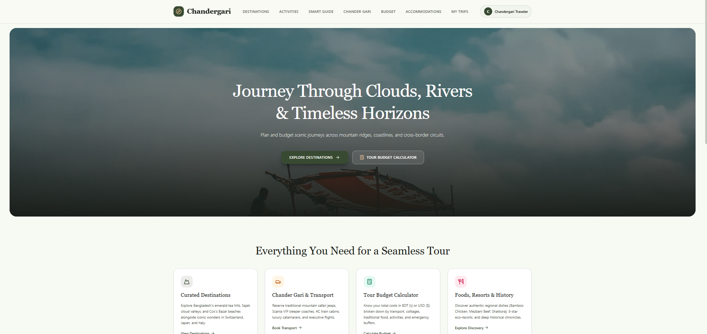
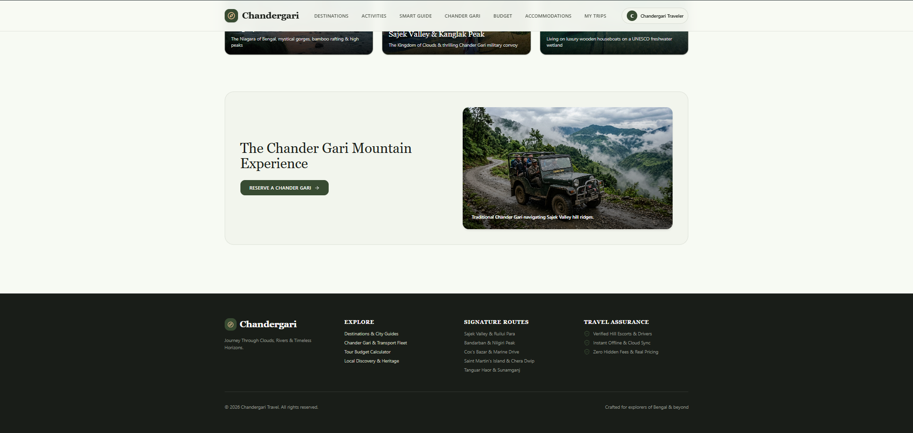

<p align="center">
  
  
</p>

<h1 align="center">CHANDERGARI — Premium Travel, Tours & Budget Planner</h1>
<h3 align="center">Destinations, Adventures, Smart Guide, Chander Gari Transport, Budget Planning & Saved Trips</h3>

<p align="center">
  
  
  
  
  
  
  
  
</p>

---

##  Executive Summary

**CHANDERGARI** is a full-stack travel planning platform for exploring Bangladesh — Sajek, Bandarban, Cox's Bazar, Sundarbans and beyond. It fuses curated destination content, adventure activities, a smart tour guide, open-roof Chander Gari transport charters, BDT-aware budget planning, local discovery and saved-trip persistence through an **Express (Node)** backend and a **React 19 + Vite + Tailwind CSS** frontend with **Firebase Auth + Firestore** (graceful offline/localStorage fallback).

###  What It Does

| Module | Core Experience | Highlights |
| :--- | :--- | :--- |
| **Destinations** | Curated destination grid with mythos storytelling | City details, ratings, imagery, save-to-trips |
| **Adventures** | Activity catalogue (trekking, boating, camping) | Difficulty, pricing, booking bridge |
| **Smart Guide** | Contextual travel guidance | Itinerary tips, transit, packing, weather-aware copy |
| **Transport** | Open-roof 4x4 Chander Gari charters | Thanchi/Nilgiri routes, per-vehicle BDT rates, USD↔BDT display |
| **Budget** | Tour budget calculator | Per-head costing, vehicle/food/stay splits, ৳122.02/USD rate |
| **Discovery** | Local stays, food & hidden gems | Accommodations, street-food lanes, free-attraction picks |
| **My Trips** | Saved trips + bookings | Firestore cloud sync + localStorage offline persistence |

---

##  System Architecture

Express serves the API and mounts Vite middleware in development (`middlewareMode`), so the **same port serves backend + SPA**:

```
Browser (:3000)
  └─ Express (server.ts)
       ├─ /api/health, /api/currency-rate, /api/bookings (mock demo store)
       └─ Vite middlewares → React SPA (src/main.tsx → src/App.tsx)
Firebase (client SDK)
  ├─ Auth: Google / Email+Password / Anonymous guest fallback
  └─ Firestore: bookings collection + localStorage mirror
```

---

##  Core Modules

### 1️⃣ Landing, Auth Gate & Navigation
* `HeroLanding`, `Header`, `Footer` with login-gated navigation (`home` open, inner pages require auth).
* `AuthModal` — Google sign-in, email register/login, one-tap guest session (`sessionStorage`).
* `onAuthStateChanged` boot sequence with offline session restore.

### 2️⃣ Destinations & City Details
* `DestinationsGrid` + `data/mockData.ts` + `data/cityDetailsData.ts` — destinations, imagery, coordinates, best seasons.
* Save/unsave destinations → feeds My Trips.

### 3️⃣ Adventures, Guide & Discovery
* `AdventureActivities` — bookable experiences.
* `SmartTourGuide` — packing, transit, weather and safety guidance.
* `LocalDiscovery` + `WeatherWidget` — stays, food lanes, offline-simulated weather fallback.

### 4️⃣ Transport (Chander Gari) & Budget
* `TransportOptions` — 4x4 mountain rovers, full-day charters, up-to-10-traveler capacity, BDT + USD pricing.
* `TourBudgetCalculator` — duration × travelers × vehicle/food/stay math with live USD→BDT (`৳122.02`) conversion.
* `utils/currency.ts` formatting helpers.

### 5️⃣ Bookings & Saved Trips (Online + Offline)
* `firebase.ts`: `saveBooking` (localStorage first, Firestore sync when non-anonymous), `getUserBookings` (remote+local merge, dedupe), `deleteBooking` (both stores).
* `SavedTripsPage` — combined booking timeline.
* Backend mirror: `GET/POST /api/bookings` demo store; `GET /api/currency-rate`.

---

##  Web Application

* **Design language**: forest `#384b32` / sand `#f7faf3` theme, Playfair Display + Inter, glassmorphism cards, Framer `motion` transitions.
* **Pages** (gated): `home`, `destinations`, `activities`, `smartguide`, `transport`, `budget`, `discovery`, `saved`.
* **Resilience**: every Firebase/Firestore call has a local fallback — the app stays usable offline as a guest.

---

##  App Tour (Screenshots)

### 1. Login

<p align="center">
  
</p>
*AuthModal — Google sign-in, email register/login, one-tap guest session.*

### 2. Homepage

<p align="center">
  
</p>
<p align="center">
  
</p>
*HeroLanding — showcase banner, featured routes and entry points into every module.*

### 3. Destinations

<p align="center">
  
</p>
*DestinationsGrid — curated spots with city details, ratings and save-to-trips.*

### 4. Activities

<p align="center">
  
</p>
*AdventureActivities — trekking, boating, camping with difficulty, pricing and booking.*

### 5. Smart Guide

<p align="center">
  
</p>
*SmartTourGuide — packing, transit, weather and safety guidance.*

### 6. Chander Gari

<p align="center">
  
</p>
*TransportOptions — open-roof 4x4 charters, Thanchi/Nilgiri routes, BDT + USD rates.*

### 7. Budget

<p align="center">
  
</p>
*TourBudgetCalculator — duration × travelers math with live ৳122.02/USD conversion.*

### 8. Accommodations

<p align="center">
  
</p>
*LocalDiscovery — boutique stays, street-food lanes and free-attraction picks.*

### 9. My Trips

<p align="center">
  
</p>
*SavedTripsPage — saved destinations plus Firestore/local booking timeline.*

---

##  Quickstart Guide

### Prerequisites
* **Node.js 20+** & `npm`

---

### 1️⃣ Install Dependencies

```bash
cd ChanderGari
npm install
```

---

### 2️⃣ Configure Environment (optional)

```bash
# Firebase client config is already in firebase-applet-config.json
# AI key only if you enable GenAI features:
# .env.local
GEMINI_API_KEY=your_key_here
```

---

### 3️⃣ Launch Application

```bash
npm run dev
```

* Web app + API: **http://localhost:3000**
* Health: **http://localhost:3000/api/health**
* Currency: **http://localhost:3000/api/currency-rate**
* Bookings: **http://localhost:3000/api/bookings**

### Other Scripts

```bash
npm run build    # vite build + esbuild server bundle → dist/
npm start        # node dist/server.cjs (production)
npm run lint     # tsc --noEmit
```

---

## 📁 Repository Structure

```
ChanderGari/
├── server.ts                 # Express + Vite middleware, mock API (/api/health, /api/currency-rate, /api/bookings)
├── src/
│   ├── App.tsx               # Auth gate, page router, booking bridge
│   ├── main.tsx              # React entry
│   ├── index.css             # Tailwind theme
│   ├── types.ts              # UserProfile, BookingRecord
│   ├── firebase.ts           # Auth (Google/email/anonymous) + Firestore + localStorage sync
│   ├── components/
│   │   ├── HeroLanding.tsx   # Landing hero
│   │   ├── Header.tsx        # Nav + auth entry
│   │   ├── Footer.tsx        # Footer nav
│   │   ├── AuthModal.tsx     # Login/register/guest
│   │   ├── DestinationsGrid.tsx
│   │   ├── AdventureActivities.tsx
│   │   ├── SmartTourGuide.tsx
│   │   ├── TransportOptions.tsx
│   │   ├── TourBudgetCalculator.tsx
│   │   ├── LocalDiscovery.tsx
│   │   ├── SavedTripsPage.tsx
│   │   └── WeatherWidget.tsx
│   ├── data/
│   │   ├── mockData.ts       # Destinations, mythos story
│   │   └── cityDetailsData.ts
│   ├── utils/
│   │   ├── currency.ts       # BDT/USD formatting
│   │   └── weather.ts        # Offline weather fallback
│   └── assets/images/        # Jeep/hero imagery
├── Images/                     # Page captures used in the App Tour above
├── index.html
├── vite.config.ts
├── tsconfig.json
├── firebase-applet-config.json
├── firestore.rules
└── README.md
```

---

##  Technology Stack

| Layer | Technologies & Frameworks |
| :--- | :--- |
| **Backend** | Express 4, Vite middleware mode, dotenv, esbuild bundle |
| **Frontend** | React 19, TypeScript 5.8, Vite 6, Tailwind CSS 4, motion, lucide-react |
| **Auth & Data** | Firebase Auth (Google/email/anonymous), Firestore, localStorage/sessionStorage fallback |
| **Content** | Curated Bangladesh destinations, BDT pricing (৳122.02/USD), Unsplash + local imagery |

---

##  Supported Destinations & Experiences

* **Sajek Valley** — Meghpunji cottages, cloud mornings, Chander Gari ascent
* **Bandarban** — Nafakhum & Debotakhum expeditions, Thanchi–Remakri routes
* **Nilgiri & Thanchi** — 4x4 mountain rover full-day charters (up to 10 travelers)
* **Cox's Bazar / Sundarbans** — beach + mangrove extensions via discovery feed
